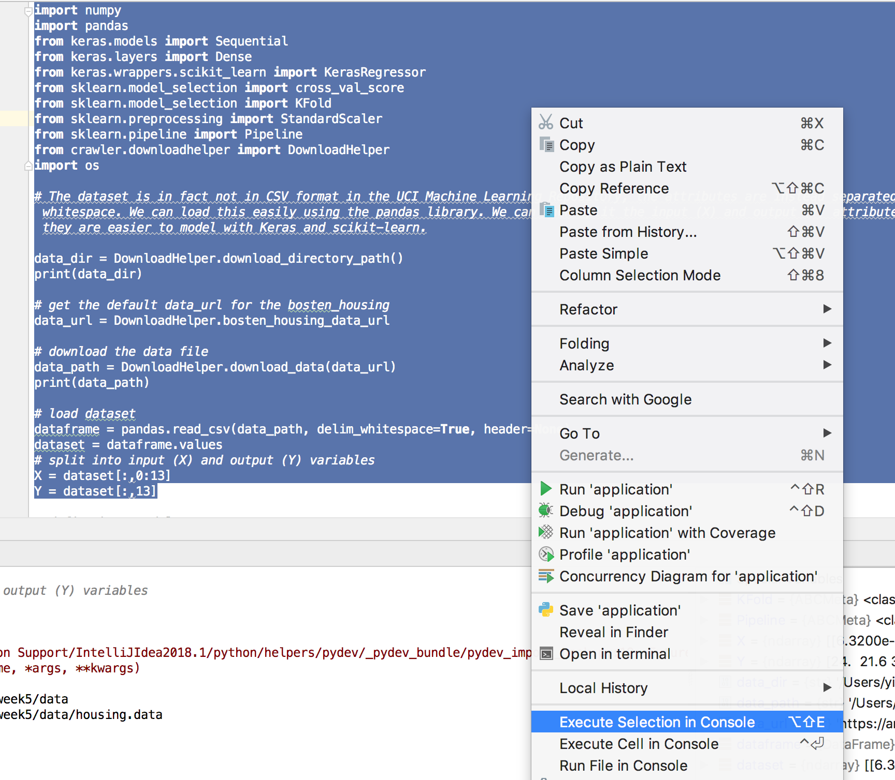

# Packages used for this tutorials:
* wget
* tensorflow
* keras
* numpy
* scikit-learn
<!-- * h5py-->

# Prerequisites
* Python Plugin shall be installed and activated in your Intellij IDEA Utmimate

# Tensorflow Installation
* <a href="https://www.tensorflow.org/install/" target="_blank">Installation Guid of TensorFlow</a>

```console
# using pip3 to install the tensorflow for Python 3.n
pip3 install --upgrade tensorflow
```
Note: the current version of TensorFlow is 1.8 on 15.May.2018

* <a href="https://www.tensorflow.org/api_docs/" target="_blank">TensorFlow API r1.8</a>

# Approach
* load a CSV dataset and make it available to Keras.
* create a neural network model with Keras for a regression problem.
* use scikit-learn with Keras to evaluate models using cross-validation.
<!-- 
* perform data preparation in order to improve skill with Keras models.
* tune the network topology of models with Keras.
-->

# How to use this example?
<!-- * run the fetch_data.py to fetch data --> 
* run the application.py to run the example (data will be fetched automatically)

# Add Virtual Environment IntelliJ Utimate 2018.1
* https://www.jetbrains.com/help/idea/2018.1/creating-virtual-environment.htmll

# Interactive Code Running in IntelliJ
* Menu -> Tools -> Python Console...
* Select the section of code that shall be run in the Python Console and press `shift + alt + E`
* Show the variables in the Python Console while press the sixth button from the toolbar positioned on the left side of the Python Console
Note: debugging will achieve the same effect

**Alternatively**: you can select the code and with the right mouse click on the code selection with "Execute Selection in Console" action.



# Change Logs 
* Since the __file__ can not be recognized by the interactive shell, refered to <a href="https://stackoverflow.com/questions/16771894/python-nameerror-global-name-file-is-not-defined" target="_blank">this stackoverflow reference</a>. The __file__ is not anymore used in the `application.py`.

# Issues
* while using the virtual environment, the virtual env shall also be added to the SDK of IntelliJ and this virtual env shall be choosen in the project structure settings of the particular IntelliJ project


